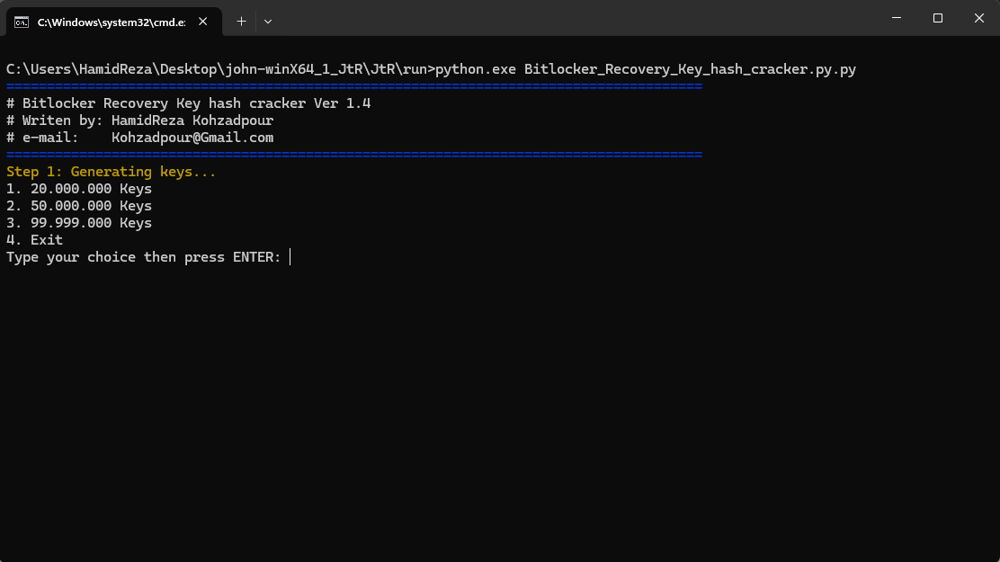
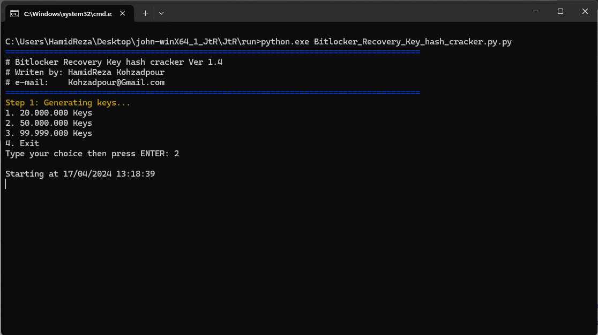
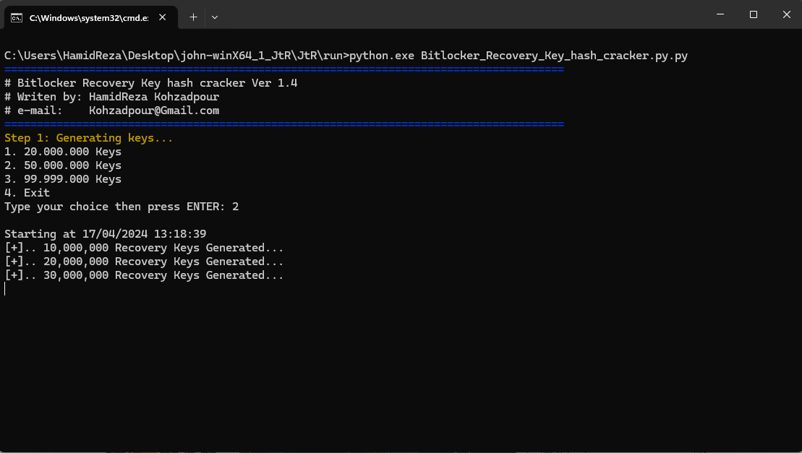
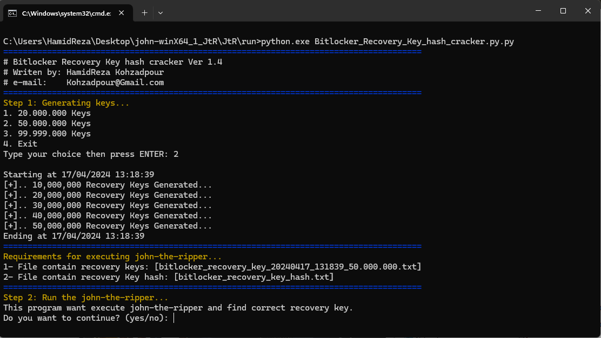
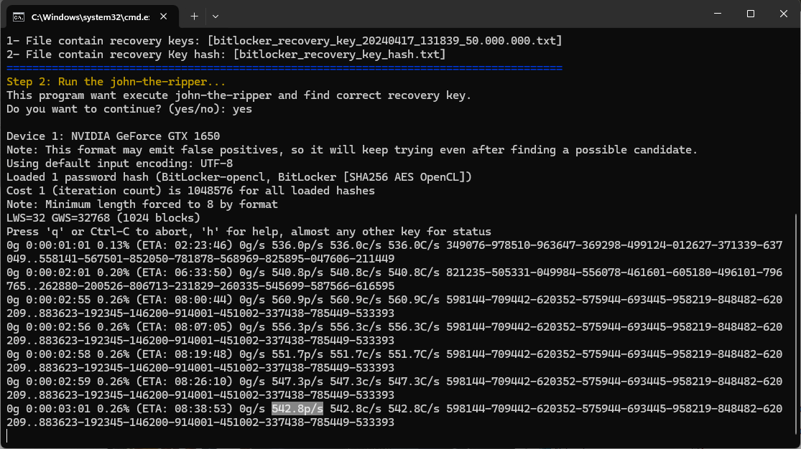

#### Markup:
1. Install python 3 on windows.
2. Download john-the-ripper from https://github.com/openwall/john.git 
3. Extract john and set for detect your GPU as Opencl-device
	Replace content of file john/etc/vendor/nvidia.icd with "c:\Windows\System32\nvopencl64.dll"
	Find file nvopencl64.dll in %windir% and copy into system32 directory
	Run cmd and execute this command: john.exe --list=opencl-devices 
4. Copy this script into run directory and side of john.exe
5. Create a file into run directory with name "bitlocker_recovery_key_hash.txt" and put hash of recovery key in the file.

	Sample: $bitlocker$3$16$bb707ffb5cc0f3651ee0oiii42b60932$1048576$12$a0625ebdcccbd80105000000$60$454096dd6kjkkiuii6091f8c9578023b5d901908527d80eb789891121kjkjc35bcdd708578894400dff0825f311e6a342afd5ef4e40a2ff7a95hjhgf9a

6. Run this command: python.exe script.py.
#### Tested on:
	windows 11,23H2 (OS Build 22631.3447)
	Python 3.12.0
####  Author:
HamidReza Kohzadpour, 2024, kohzadpour@gmail.com

